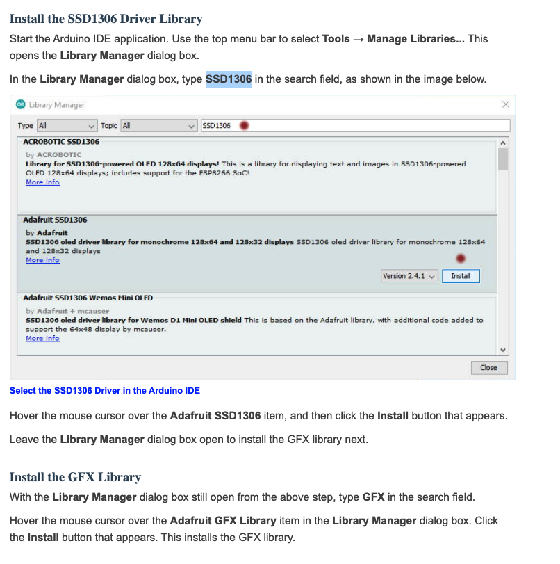

# OLED EXAMPLES 

---
### CONNECTION DETAILS 


### LIBRARY DETAILS 


```
display.clearDisplay() – all pixels are off
display.drawPixel(x,y, color) – plot a pixel in the x,y coordinates
display.setTextSize(n) – set the font size, supports sizes from 1 to 8
display.setCursor(x,y) – set the coordinates to start writing text
display.print(“message”) – print the characters at location x,y
display.display() – call this method for the changes to make effect
```

### Example 
```
#include <Wire.h>
#include <Adafruit_GFX.h>
#include <Adafruit_SSD1306.h>

#define SCREEN_WIDTH 128 // OLED display width, in pixels
#define SCREEN_HEIGHT 64 // OLED display height, in pixels

// Declaration for an SSD1306 display connected to I2C (SDA, SCL pins)
Adafruit_SSD1306 display(SCREEN_WIDTH, SCREEN_HEIGHT, &Wire, -1);

void setup() {
  Serial.begin(115200);

  if(!display.begin(SSD1306_SWITCHCAPVCC, 0x3C)) { // Address 0x3D for 128x64
    Serial.println(F("SSD1306 allocation failed"));
    for(;;);
  }
  delay(2000);
  display.clearDisplay();

  display.setTextSize(1);
  display.setTextColor(WHITE);
  display.setCursor(0, 10);
  // Display static text
  display.println("Hello, world!");
  display.display(); 
}

void loop() {
  
}
```