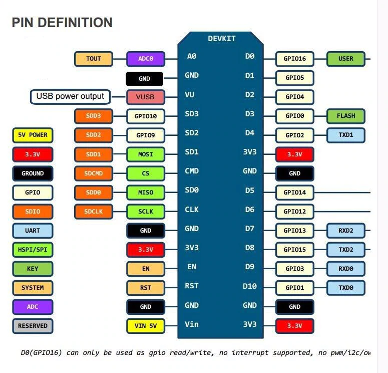
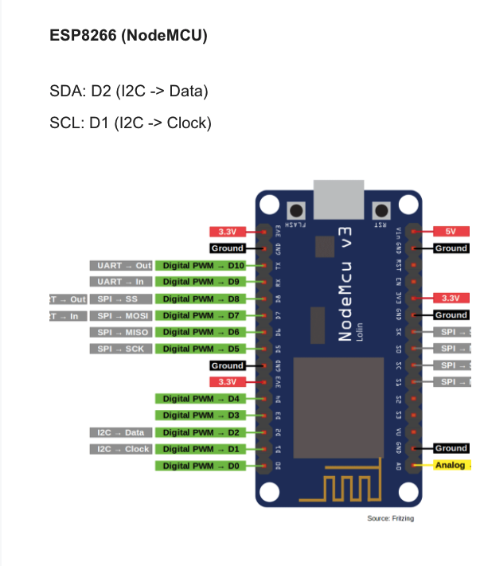
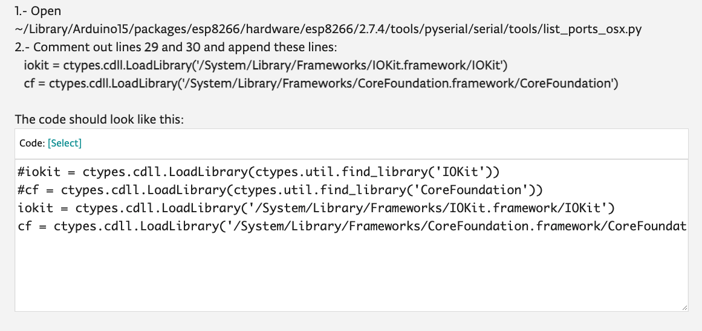

# ESP8266 

--- 







## HELP URL 
* https://learn.sparkfun.com/tutorials/how-to-install-ch340-drivers/all#drivers-if-you-need-them

## DRIVER URL 
* https://www.silabs.com/documents/public/software/Mac_OSX_VCP_Driver.zip

### [CLICK TO DOWNLOAD](https://github.com/adarshkumarsingh83/arduino/raw/master/DOCUMENTS/ESP8266/driver/Mac_OSX_VCP_Driver.zip)

## Insttallation 
```
for mac use applle usb connector or compatable connector  

 Download the direr for MAC ch340 
 after down and insallation check in the Device Manger the Port for the ESP8266 

 then visit the url https://github.com/esp8266/Arduino
 copy the 
 then in arduino IDE 

Start Arduino and open ->  Preferences window.
Enter Url 
https://arduino.esp8266.com/stable/package_esp8266com_index.json 
into the File > Preferences > Additional Boards Manager URLs field of the Arduino IDE. You can add multiple URLs, separating them with commas.

Open Boards Manager from Tools > Board menu and install esp8266 platform from community version 

then select the Board Manager -> esp8266 board -> NodeMce 1.0 (ESP-12E Module)

then Test from the File -> Example -> ESP8266 -> Blink 

```


# for solving the errror on bigsur mac os 
### https://forum.arduino.cc/index.php?topic=702144.0



```

1.- Open ~/Library/Arduino15/packages/esp8266/hardware/esp8266/2.7.4/tools/pyserial/serial/tools/list_ports_osx.py
2.- Comment out lines 29 and 30 and append these lines:
   iokit = ctypes.cdll.LoadLibrary('/System/Library/Frameworks/IOKit.framework/IOKit')
   cf = ctypes.cdll.LoadLibrary('/System/Library/Frameworks/CoreFoundation.framework/CoreFoundation')
```

# Code must look like this now 
```
kit = ctypes.cdll.LoadLibrary(ctypes.util.find_library('IOKit'))
#cf = ctypes.cdll.LoadLibrary(ctypes.util.find_library('CoreFoundation'))
iokit = ctypes.cdll.LoadLibrary('/System/Library/Frameworks/IOKit.framework/IOKit')
cf = ctypes.cdll.LoadLibrary('/System/Library/Frameworks/CoreFoundation.framework/CoreFoundation')
```