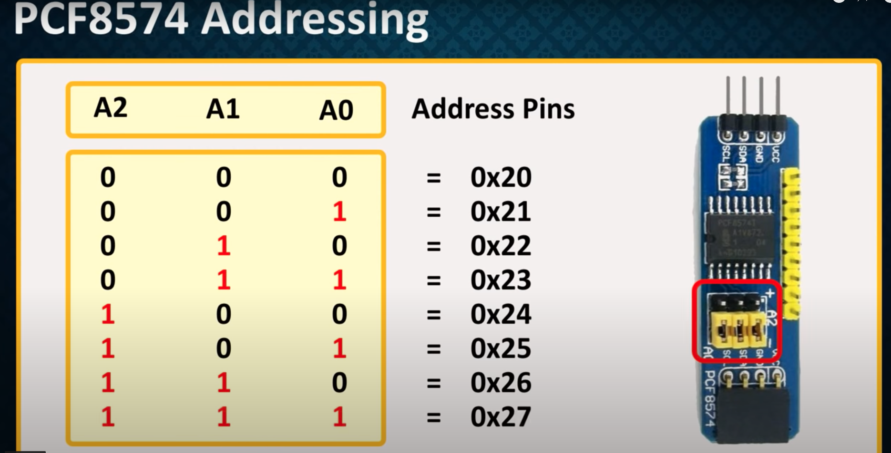
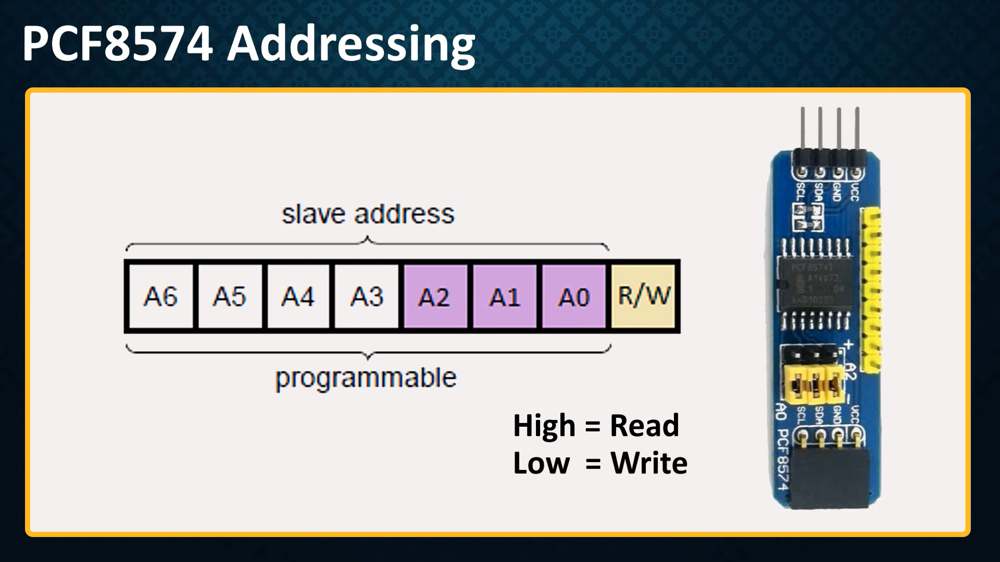
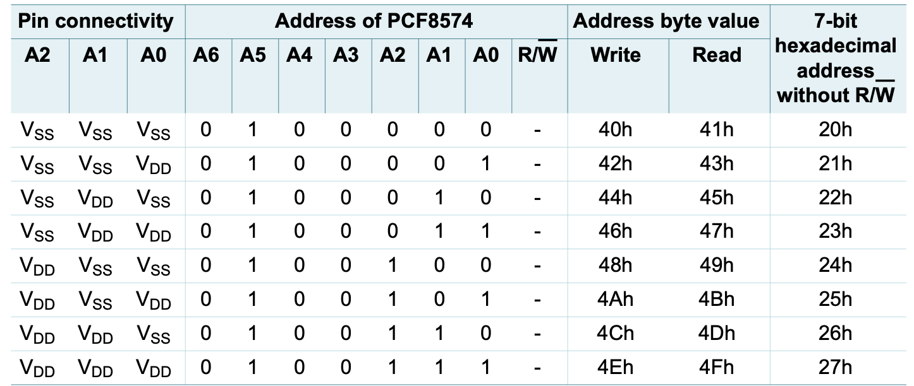

# PCF8574 

--- 

# YOUTUBE LINK
[](https://www.youtube.com/watch?v=HQZA2aJluAk "PCF8574")

```
PCF8574 is GPIO pin extends which will provide addition 8 pins with 
one intruppt pin which can be used to read change in any particular pin 
we can connect the 8 board in chain with address 0x20 to 0x27 
which will provide additional 64 pins for io operations 
```


## Address Configuation details 







```

for different adddress configuation we have to set the jumper of Pcf8574 board like shown in the above image 
and we can set 8 boareds with 0x21 to 0x27 addressing with 8pin in each board
```


## Connect Details 
```
we have connect the sda and scl from arduino to Pcf8574 board 
+5v vcc and gnd pin from arduino to Pcf8574 board 
then connect the device on pin po to p7 for controlling them 
use the vcc of the last board for powering up the device 

NOTE: this board will work in opposite when its hight its off and when its low its on 
this board will complete the circuit when its pin is low which is on when pin is hight this will be off 
due to that we will take last board vcc and pin p0 to p7 gnd to complete tthe circuit 

```
