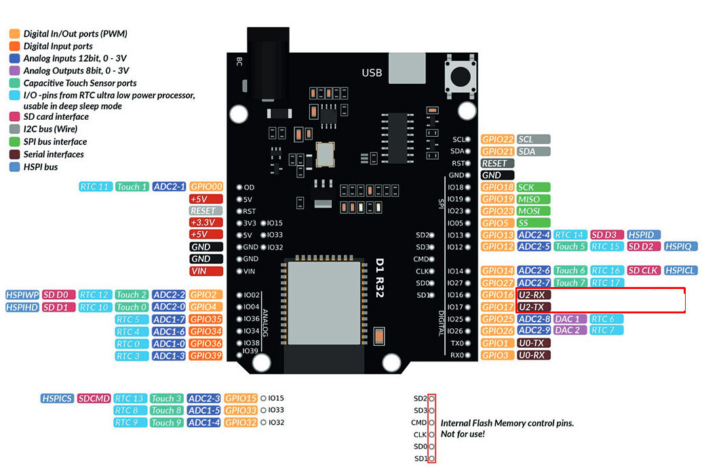
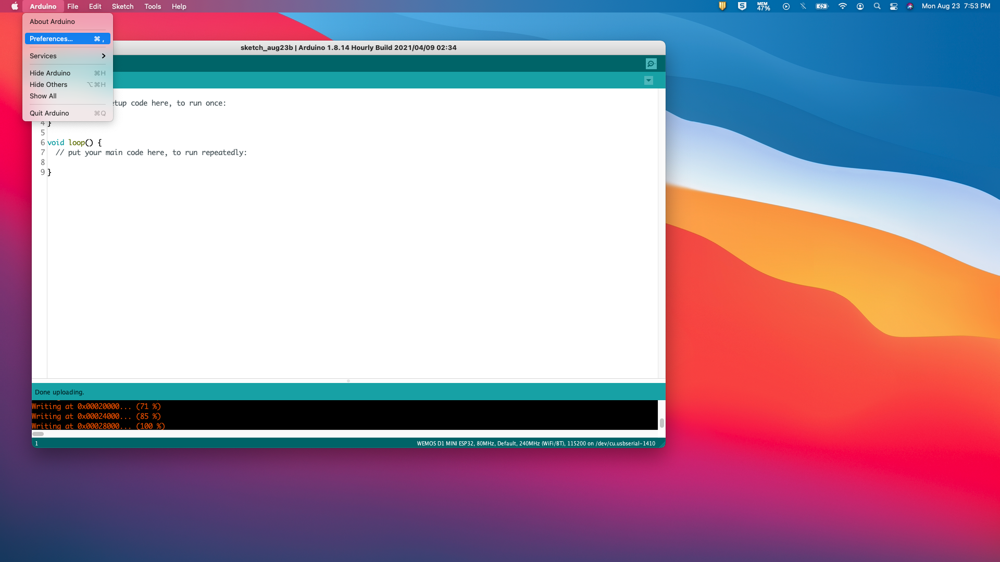
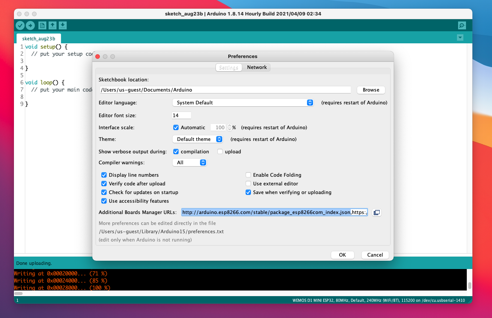
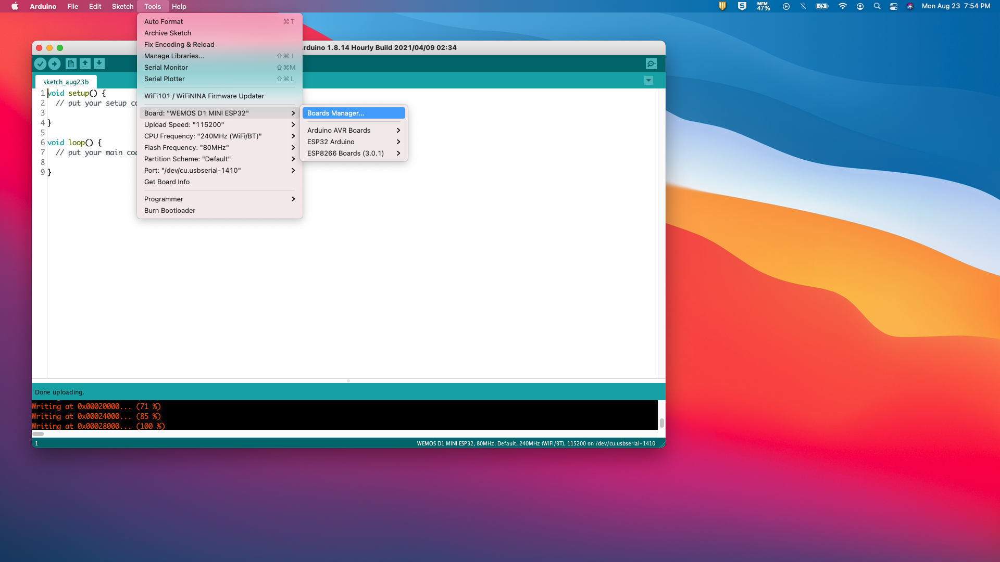
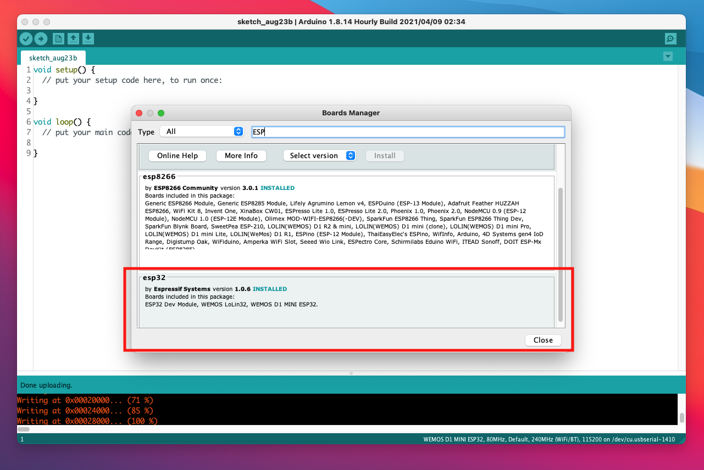
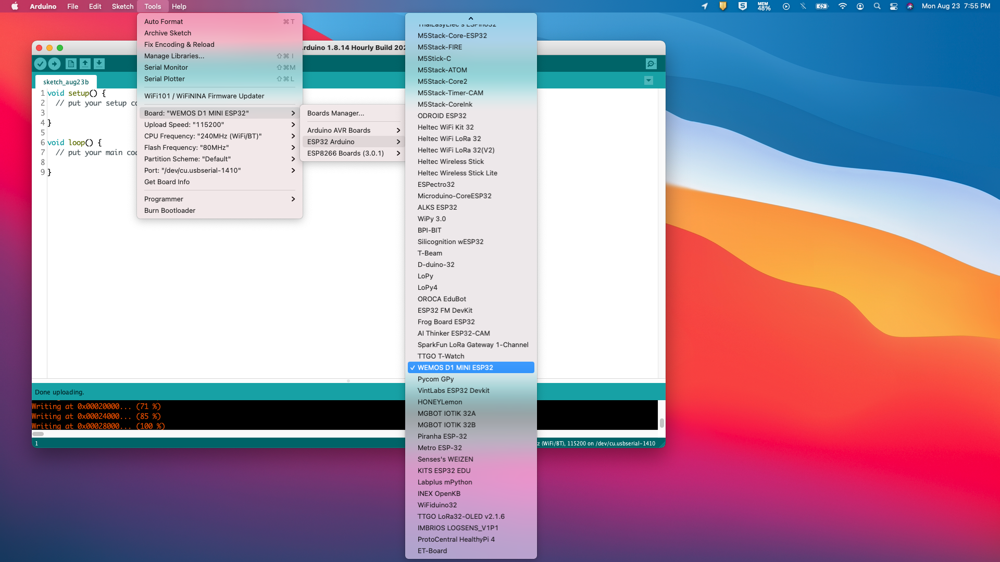
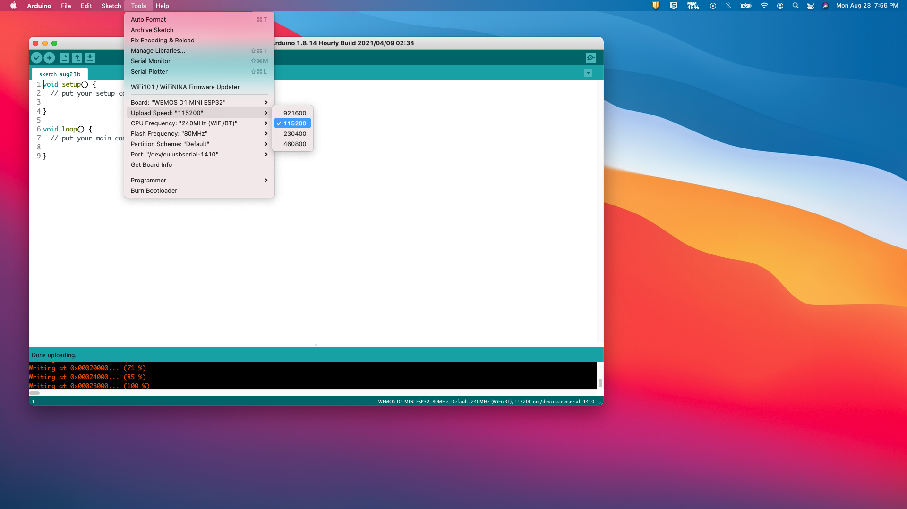
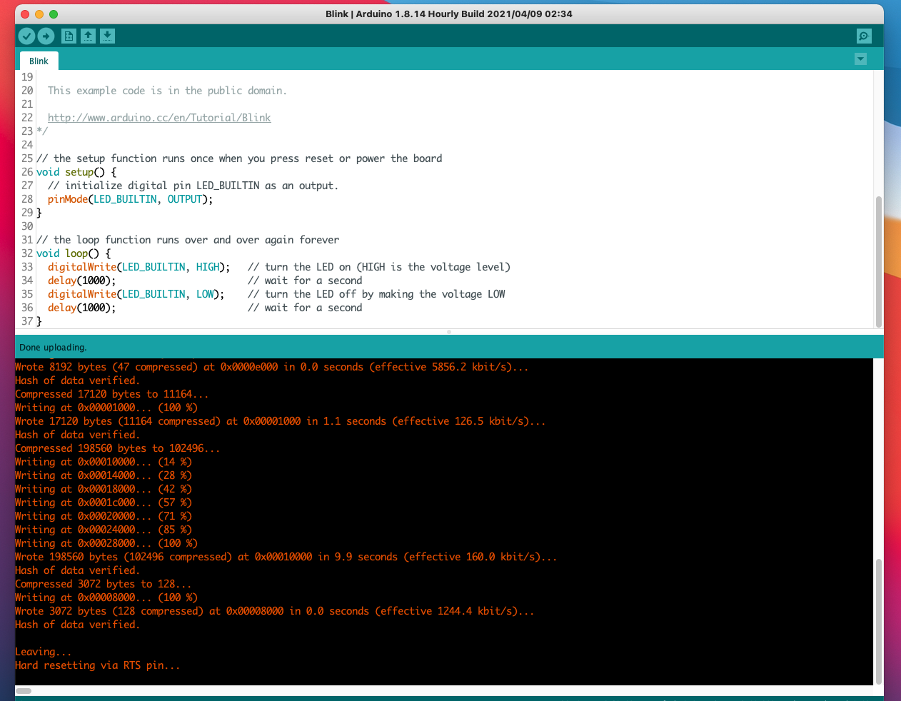

# WEMOS-D1-R32

### INSTALL THE CH340 DRIVER FOR COMPUTER 

[mac drivers](https://github.com/adarshkumarsingh83/arduino/raw/master/DOCUMENTS/wemos-d1-r32-esp32/drivers/mac-CH34x_Install_V1.5.pkg.zip)

[windows drivers](https://github.com/adarshkumarsingh83/arduino/raw/master/DOCUMENTS/wemos-d1-r32-esp32/drivers/windows-CH34x_Install_v3_4.zip)


### INSTALL THE BOARD MANGER JSON 

```  

Open the Arduino IDE &  select this COM port.

From TOOLS  —>  BOARDS  —> BOARDS MANAGER install the package for ESP8266.

Prior to this , you need to provide the link from where the Boards manager will look for the package.

To do this copy the following Link

http://arduino.esp8266.com/stable/package_esp8266com_index.json

Go to FILE  –> PREFERENCES on Arduino IDE

Paste the link against the Additional Boards Manager URLs ,seen at the bottom of preferences screen & click OK.

```

### INSTALL THE LIBRARY FOR THE BOARD 
```
Now open the TOOLS –> BOARDS –> BOARDS MANAGER -> 

Search for ESP8266

Now you will find the package from ESP8266 Community.

Select the latest version from drop down & install it.

```


### SELECT THE BOARD 
```
Now open the TOOLS –> BOARDS –> BOARDS MANAGER -> WIMOS D1 MINI ESP32
```









